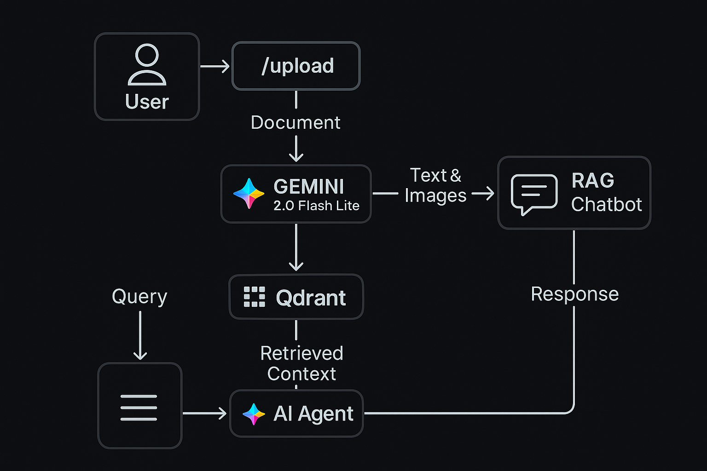

# 🧠 Bajaj Finserv AMC RAG Chatbot
[](https://nextjs.org/)
[](https://reactjs.org/)
[](https://fastapi.tiangolo.com/)
[](https://www.langchain.com/)
[](https://developers.google.com/vertex-ai)
[](https://qdrant.io/)
[](https://vercel.com/)
[](https://render.com/)

🔗 **Live Demo:** [bajaj-finserv-assingment.vercel.app](https://bajaj-finserv-assingment.vercel.app)

---

## 🚀 Overview

The **Bajaj Finserv AMC RAG Chatbot** is an intelligent **Retrieval-Augmented Generation (RAG)** system that answers complex questions about **Bajaj AMC Fund Factsheets**.

💡 **Key Features:**

* Multi-modal understanding (text + charts + tables + visuals)
* Context-aware financial reasoning
* Explainable AI responses grounded in the source documents

---

## 🧩 System Architecture



> **Workflow:**
> 📝 PDF upload → 🖼️ Image processing → 🤖 Gemini multi-modal extraction → 🔗 Vector storage in Qdrant → 💬 Chatbot response generation

---

## ⚙️ Data Ingestion Pipeline

When a user uploads a **fund factsheet PDF**, here’s the behind-the-scenes process:

1. 📤 **Upload** — Sent to the `/upload` endpoint.
2. 🖼️ **PDF → Image** conversion via `PyMuPDF`.
3. 🤖 **Image-to-text extraction** using **Gemini-2.0-Flash-Lite (Vision)**. Captures **text, tables, charts, visuals** — no OCR needed.
4. 🧩 **Chunking** — Segments extracted data into contextual pieces.
5. 📚 **Vectorization** — Each chunk embedded using **Gemini Embedding Model**.
6. 💾 **Storage** — Saved in **Qdrant VectorDB** for retrieval.

### 🔍 Why Gemini Vision?

| 🔹 Feature       | Gemini Vision 🧠                  | Traditional OCR 🧾 |
| :--------------- | :-------------------------------- | :----------------- |
| Charts & Tables  | Understands structure & semantics | Plain text only    |
| Visual Reasoning | Interprets icons, layouts, graphs | Not supported      |
| Setup            | Requires API access               | Simple             |
| Accuracy         | High for multi-modal content      | Limited            |
| Best Use Case    | Mixed-format documents            | Pure-text scans    |

---

## 💬 Chat Retrieval & Response Flow

1. 📨 **Query** → Gemini-2.5-Flash agent
2. 🔍 **Decision** → Retrieve context (RAG) or answer directly
3. 📈 **Retrieval** → MMR (Maximal Marginal Relevance) from Qdrant
4. 🤖 **Response Generation** → Context + Query → Gemini reasoning
5. 💬 **Answer Displayed** → Users see grounded, contextual response
6. 🔎 **Transparency** → Click `...` to view retrieved context

---

## 🧱 Tech Stack

| Layer               | Tools & Libraries                                                               | Hosting / Notes        |
| :------------------ | :------------------------------------------------------------------------------ | :--------------------- |
| **Backend**         | FastAPI, LangChain, Google Generative AI, Qdrant Client, PyMuPDF                | Hosted on **Render**   |
| **Frontend**        | Next.js, React, Tailwind CSS, Lucide Icons                                      | Hosted on **Vercel**   |
| **AI Models**       | Gemini-2.0-Flash-Lite (Vision), Gemini-2.5-Flash (Text), Gemini Embedding Model | API-based              |
| **Database**        | Qdrant Vector Database                                                          | Managed cloud instance |
| **Search Strategy** | Maximal Marginal Relevance (MMR)                                                | RAG Retrieval          |

---

## 🔐 Environment Configuration

Create `.env` in both backend & frontend:

```bash
GOOGLE_API_KEY=your_google_api_key_here
QDRANT_API_KEY=your_qdrant_api_key_here
QDRANT_API_KEY_LOCATION=your_qdrant_cluster_url
TAVILY_API_KEY=your_tavily_api_key_here
COLLECTION_NAME=your_qdrant_collection_name_here
```

⚠️ **Required for ingestion, retrieval, and chat functionality.**

---

## 📂 Project Structure

```
├── backend/
│   ├── main.py
│   ├── .env
│   ├── requirements.txt
│   ├── pipeline_for_document_ingestion/
│   │   └── docsProcessing.py
│   └── rag_pipeline/
│       ├── google_agent.py
│       └── tools.py
├── frontend/
│   ├── next.config.ts
│   ├── package.json
│   ├── tailwind.config.ts
│   ├── src/
│   │   ├── app/
│   │   │   ├── page.tsx
│   │   │   ├── upload/page.tsx
│   │   │   ├── layout.tsx
│   │   ├── context/
│   │   │   ├── ThemeContext.tsx
│   │   │   ├── UploadContext.tsx
│   │   └── components/
│   │       ├── Notification.tsx
│   │       ├── ChatContainer.tsx
│   │       └── ContextViewer.tsx
└── scripts/
```

---

## ⚙️ Installation & Setup

### 1️⃣ Clone

```bash
git clone https://github.com/SujalPore47/BAJAJ_Finserv_Assingment-.git
```

### 2️⃣ Backend

```bash
cd backend
python -m venv venv
# Activate venv
pip install --upgrade pip
pip install --no-deps google-generativeai google-ai-generativelanguage langchain-google-genai
pip install --no-deps langchain langchain-core langchain-qdrant langgraph langgraph-checkpoint langgraph-prebuilt langgraph-sdk langsmith
pip install --no-cache-dir --no-deps -r requirements.txt
```

> ⚠️ Update `CORS` in `backend/main.py` for localhost during development.

### 3️⃣ Frontend

```bash
cd frontend
npm install
```

> ⚠️ Update `API URLs` in `frontend/next.config.ts` for local backend.

---

## ▶️ Running

**Backend:**

```bash
cd backend
uvicorn main:app --reload
```

**Frontend:**

```bash
cd frontend
npm run dev
```

Open [http://localhost:3000](http://localhost:3000)

---

## 🌗 Frontend Highlights

✨ Dark/Light Mode based upon browsers theme
📤 File upload with real-time feedback
🔎 View AI context transparency (`...`)
⚡ Smooth Tailwind + Lucide animations

---

## 🌐 Deployment

| Component     | Platform     | Notes                                                                                        |
| :------------ | :----------- | :------------------------------------------------------------------------------------------- |
| **Frontend**  | Vercel       | Live App: [bajaj-finserv-assingment.vercel.app](https://bajaj-finserv-assingment.vercel.app) |
| **Backend**   | Render       | API endpoints hosted, accessible to frontend                                                 |
| **Vector DB** | Qdrant Cloud | Managed vector database for RAG retrieval                                                    |

---

## 🔮 Future Enhancements

* 📚 Multi-PDF ingestion + cross-document reasoning
* 🧠 Domain-adaptive financial embeddings
* ⚡ Semantic caching for repeated queries

---

## 👤 Author

**Sujal Pore**
🔗 [GitHub](https://github.com/SujalPore47)
💬 Open to collaboration, feedback, and optimizations!

---
